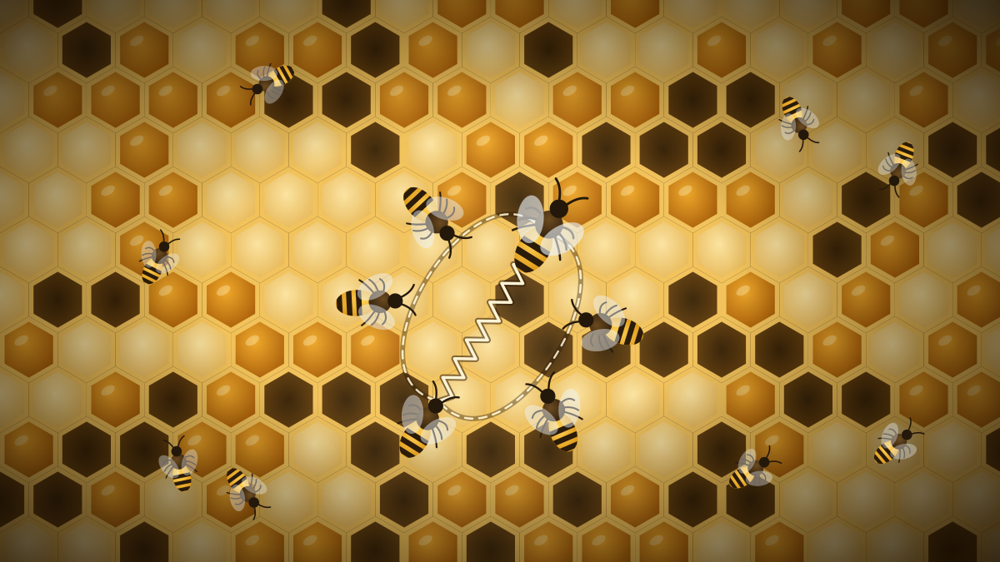
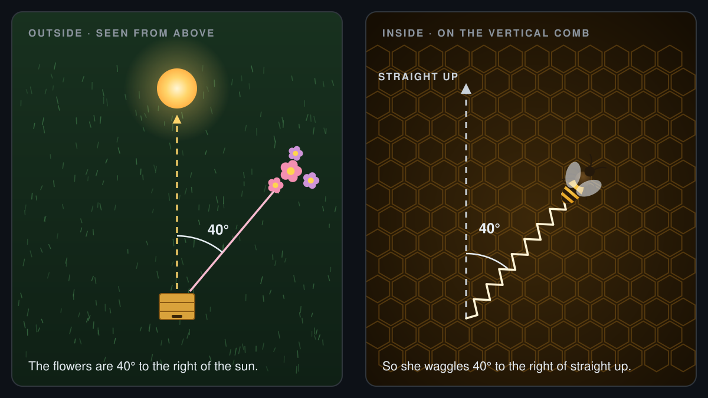

A honeybee who finds a rich patch of flowers has a problem. The flowers might be two kilometres away. The hive is pitch dark. Her sisters can't see where she has been, and she can't point. So she does something remarkable: she climbs onto the comb and **dances a map**.

The dance was decoded in the 1940s by the Austrian zoologist Karl von Frisch, after decades of patient work with marked bees and glass-walled hives [1]. It earned him a share of the 1973 Nobel Prize in Physiology or Medicine [5]. Once you know the code, you can read it too.

## The waggle run

The heart of the dance is the **waggle run**. The forager walks in a straight line across the comb while shaking her abdomen rapidly from side to side and buzzing her wings. At the end of the run she turns, circles back to where she started, and does it again, looping round to the left one time and to the right the next.

Seen from above, she traces a figure of eight with a wiggly line through the middle. She may repeat it dozens of times, and other bees press in close behind her to follow each run.

That one wiggly line carries two pieces of information:

- its **angle** says which way to fly;
- its **length** says how far to go.

## Direction: the sun is "up"

The comb hangs vertically in the dark, so the dancer can't show the sun. Instead she uses gravity. In the language of the dance, **straight up the comb stands for the direction of the sun**.

If the flowers lie directly towards the sun, she waggles straight up. Directly away from the sun, she waggles straight down. If they are 40° to the right of the sun, she waggles 40° to the right of vertical. Her sisters feel the angle of her body in the dark, step out of the hive, and fly at that same angle to the sun.

There's a subtlety. The sun moves across the sky by about 15° an hour, so a fixed angle would slowly drift off target. Bees allow for this: a forager dancing for a long time gradually rotates her runs to keep pace with the sun, even though she can't see it from inside the hive [1].

> [!NOTE]
> On a cloudy day, bees can still find the sun as long as a patch of blue sky shows. Light from blue sky is polarised in a pattern that depends on where the sun is, and bees' eyes can see that pattern.

## Distance: how long she waggles

The farther away the food, the **longer each waggle run lasts**. As a rough rule of thumb, each second of waggling stands for something like a kilometre of flight, though the exact scale varies from one colony to another.

For food very close to the hive, within a few dozen metres, the runs become so short that the dance looks like the dancer is just turning in tight circles. Von Frisch called this the **round dance** [1]. It says, in effect: "It's nearby. Go and look."

## How a bee measures distance

How does a bee know how far she flew? Not by counting wingbeats or by how tired she is, it turns out, but by **how much of the world has streamed past her eyes**, an effect known as optic flow.

Researchers tested this by training bees to fly to food at the end of a narrow tunnel lined with a busy chequered pattern [3, 4]. Because the walls were so close, the pattern rushed past their eyes far faster than open countryside would. When they got home, the bees danced as though they had flown a long way, much farther than the few metres they had actually covered. Their odometer had been fooled.

## Reading the dance

Inside the hive there's no light to see by, so followers read the dance by touch and sound. They keep their antennae on the dancer, sensing the angle and rhythm of her body and the buzz of her wings. They also smell the scent of the flowers on her and taste the samples of nectar she hands out.

The dance carries one more message: **how good the food is**. A forager who has found a rich, sugary source dances more circuits, and more vigorously, than one who has found something mediocre. Poor sources hardly get danced for at all. Without anyone in charge, this steers more of the colony's foragers to the best flowers.

## Not just for food

The same dance is used for an even bigger decision. When a colony swarms, scouts fly off to inspect possible new homes, such as hollow trees and holes in walls, and come back to dance for the ones they found. Better sites earn livelier dances and recruit more scouts, until the swarm reaches a consensus and flies off together [2].

## In short

- A forager dances a **figure of eight**, with a waggle run through the middle.
- The **angle** of the waggle run from straight up equals the angle of the food from the sun.
- The **duration** of the waggle run tells the distance, measured by optic flow.
- Followers read it **by touch, sound and smell** in the dark.
- The **liveliness** of the dance reflects how good the food, or the new home, is.

## References

1. von Frisch, K. (1967). *The Dance Language and Orientation of Bees*. Harvard University Press.
2. Seeley, T. D. (2010). *Honeybee Democracy*. Princeton University Press.
3. Srinivasan, M. V., Zhang, S., Altwein, M., & Tautz, J. (2000). Honeybee navigation: nature and calibration of the "odometer". *Science*, 287, 851–853. doi:10.1126/science.287.5454.851
4. Esch, H. E., Zhang, S., Srinivasan, M. V., & Tautz, J. (2001). Honeybee dances communicate distances measured by optic flow. *Nature*, 411, 581–583. doi:10.1038/35079072
5. The Nobel Prize in Physiology or Medicine 1973. NobelPrize.org. <https://www.nobelprize.org/prizes/medicine/1973/summary/>
