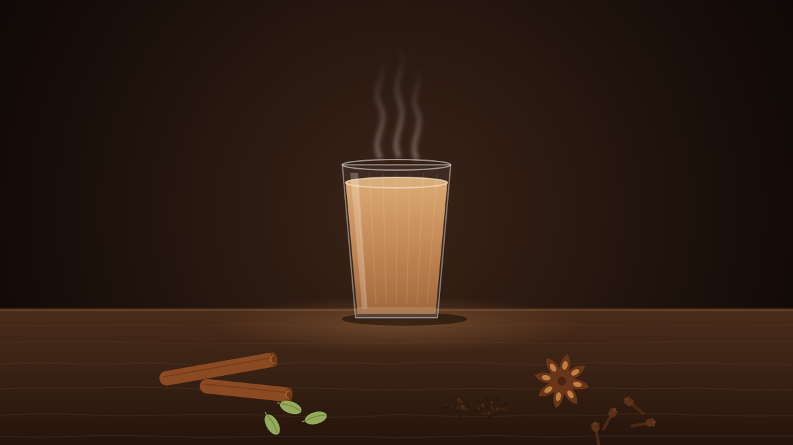
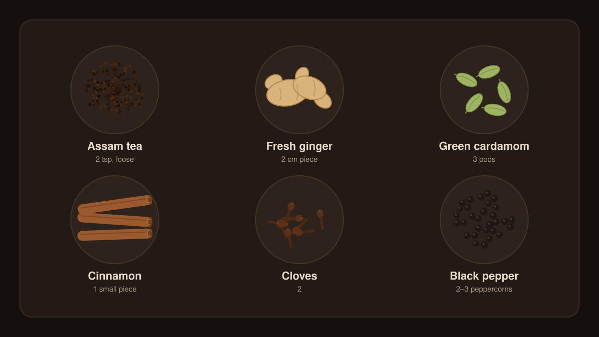

There's tea, and then there's chai. Masala chai is black tea simmered with milk, sugar and whole spices until it's strong, milky and fragrant. It's poured from big kettles at railway stations across India, served in small glasses at roadside stalls, and made at home every morning, slightly differently in every kitchen.

This is a simple, forgiving recipe. Once you've made it a few times you'll start adjusting it to your taste, which is the whole point.

## What you'll need

For **two cups**:

| Ingredient | Amount | What it does |
| --- | --- | --- |
| Water | 1 cup (240 ml) | Draws out the spices and tea |
| Whole milk | 1 cup (240 ml) | Body and creaminess |
| Loose black tea (Assam or CTC) | 2 teaspoons | A strong, malty base |
| Fresh ginger | 2 cm piece, crushed | Heat and brightness |
| Green cardamom | 3 pods, lightly crushed | The signature aroma |
| Cinnamon | 1 small piece | Warmth and sweetness |
| Cloves | 2 | Depth |
| Black peppercorns | 2–3, cracked | A gentle kick |
| Sugar | 2–3 teaspoons, to taste | Rounds everything out |

> [!TIP]
> Crush the spices just before you use them. A mortar and pestle is ideal, but the flat of a knife or the bottom of a mug works too. Freshly cracked whole spices have far more flavour than pre-ground ones.

## Method

1. **Simmer the spices.** Put the water, ginger, cardamom, cinnamon, cloves and pepper in a small pan. Bring to a boil, then simmer for 2–3 minutes. The water will turn pale gold and your kitchen will start to smell wonderful.
2. **Add the tea.** Stir in the tea leaves and sugar, and simmer for another minute, until the liquid is a deep, dark brown.
3. **Add the milk.** Pour in the milk and turn up the heat. Watch the pan closely: it is about to try to escape.
4. **Let it rise, twice.** When the chai foams up toward the rim, lower the heat (or lift the pan off) until it settles, then let it rise once more. This boiling up gives chai its body and its colour.
5. **Strain and serve.** Pour through a fine strainer into cups or glasses, and drink it hot.

The whole thing takes about ten minutes.

## Make it your own

Chai is less a recipe than a set of habits. A few common variations:

- **Stronger:** add a little more tea, or let it simmer a minute longer after the milk goes in.
- **Creamier:** use more milk and less water, up to two parts milk to one part water.
- **For ginger lovers:** double the ginger. It's especially good when you have a cold.
- **Simpler:** skip everything except the ginger and cardamom. Plenty of households do, and it's lovely.
- **Dairy-free:** oat milk works best. Add it at the end and heat it gently rather than boiling hard, or it can turn thick.

## Common mistakes

- **Adding the milk too early.** Tea and spices give up their flavour more easily in water, so give them a head start.
- **Walking away from the pan.** Chai boils over in seconds. Stay close.
- **Using tea bags.** They'll do in a pinch, but loose CTC tea is much stronger and stands up to the milk and spices.

Pour two glasses, and find someone to give the second one to.
