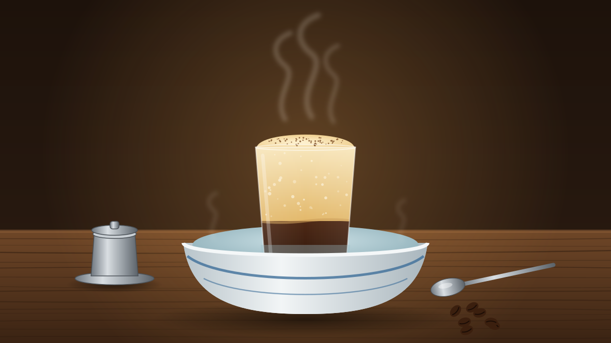
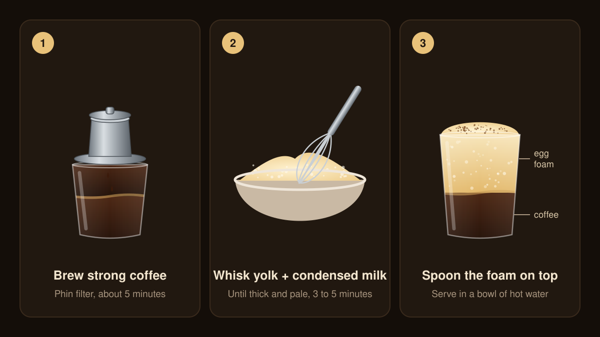

The first time you hear "egg coffee", it sounds like a mistake. Then someone puts one in front of you: a small glass of dark, bitter coffee topped with a thick, pale layer of egg yolk whipped with sweetened condensed milk. You eat the top with a spoon, like a custard, before stirring the rest together. It tastes a bit like tiramisu, a bit like eggnog, and entirely like Hanoi.

In Vietnamese it's **cà phê trứng**, and it's easy to make at home.

## A shortage that became a classic

The story usually told goes like this. In 1946, fresh milk was scarce in Hanoi. Nguyễn Văn Giảng, a bartender at the Metropole hotel, started whipping egg yolks as a stand-in for milk in coffee. It caught on, he eventually opened his own café, and his family still serves it in Hanoi's Old Quarter today. Whatever the exact details, it's now on menus all over the city.

## What you'll need

For **one cup**:

| Ingredient | Amount | Notes |
| --- | --- | --- |
| Vietnamese ground coffee | 2 tablespoons (about 12 g) | A dark, robusta-heavy roast is traditional |
| Just-boiled water | 60 ml (¼ cup) | For brewing |
| Egg yolk | 1, very fresh | Pasteurised, if you can get them |
| Sweetened condensed milk | 2 tablespoons | Sweetness and body |
| Sugar | 1 teaspoon | Optional; makes the foam firmer |
| Vanilla extract | 1 drop | Optional; softens any eggy taste |

The traditional brewer is a **phin**: a small steel filter cup that sits on top of your glass and drips the coffee through slowly. No phin? Use a double shot of espresso, or 60 ml of very strong coffee from a moka pot or French press.

## Method

1. **Set up a warm bath.** Stand a small heatproof glass or cup in a bowl, and pour hot water into the bowl until it comes about a third of the way up the cup. The cold foam cools the coffee quickly, and this keeps it warm.
2. **Brew the coffee.** Put the coffee in the phin, shake it level, and set the press disc on top. Pour in about 20 ml of the hot water and wait 30 seconds while the grounds swell. Then add the rest of the water, put the lid on and let it drip into the cup. It should take 4 to 5 minutes. If it runs through much faster, press the disc down a little firmer next time.
3. **Whisk the yolk.** While the coffee drips, put the egg yolk, condensed milk, sugar and vanilla in a small bowl and whisk hard until the mixture is pale, thick and roughly doubled in volume. That takes 2 to 3 minutes with a handheld milk frother or electric whisk, or 5 minutes or more by hand. It's ready when it falls off the whisk in a slow, thick ribbon.
4. **Layer it.** Gently spoon the foam over the hot coffee. It should float in a thick layer on top. Dust it with a little cocoa if you like.
5. **Drink it.** Eat the first few spoonfuls of foam on their own, then stir it down into the coffee and drink the rest while it's hot.

> [!WARNING]
> The egg yolk isn't cooked. If you're pregnant, or making this for someone very young, elderly, or with a weakened immune system, use pasteurised eggs.

## Tips

- **Separate the egg carefully.** Stray egg white makes the foam taste more eggy and doesn't whip as thick.
- **Whisk longer than you think.** A runny foam sinks into the coffee. A well-whipped one is thick enough that a spoon dragged across it leaves a trail.
- **Use strong coffee.** The foam is very sweet, and weak coffee gets lost under it.

> [!TIP]
> Try the variations Hanoi cafés serve. For **iced egg coffee**, pour the coffee over ice in a glass and spoon the foam on top. For **egg cocoa**, swap the coffee for strong hot chocolate.
