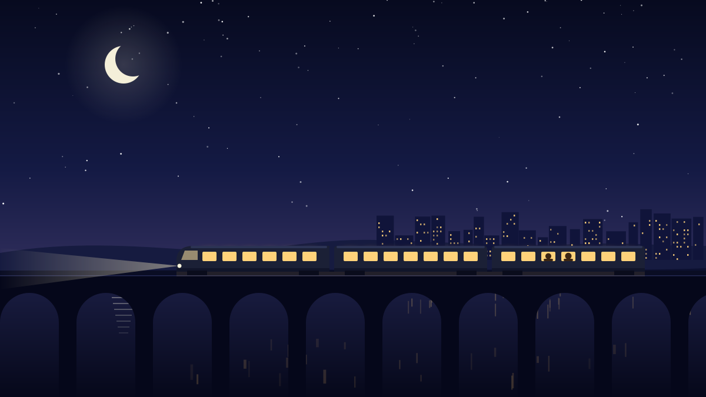
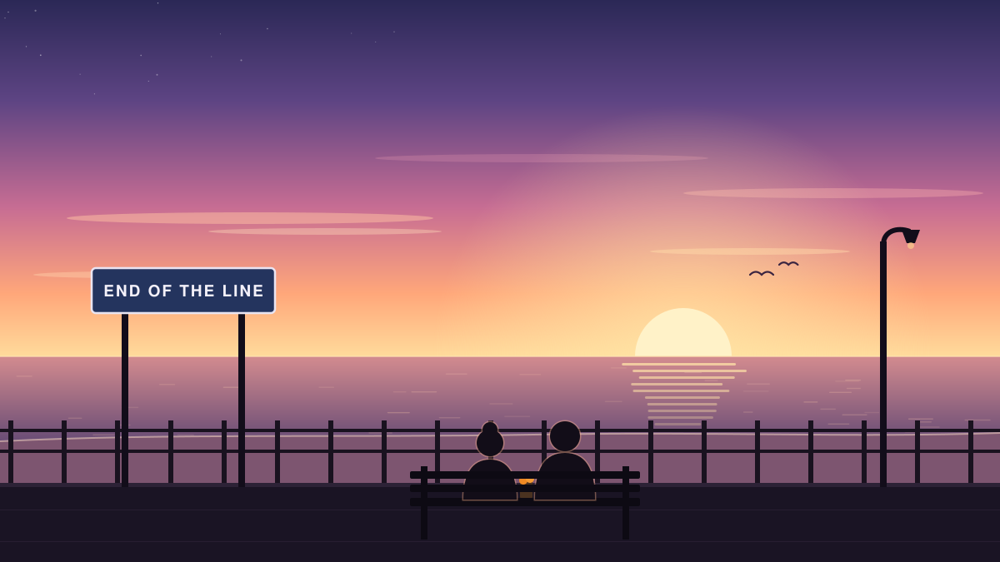

The 11:52 was the last train out of the city, and Arjun only caught it because he ran. He dropped into a seat in the end carriage, chest heaving, and only when the doors had shut and the platform had slid away did he notice that the carriage was not empty.

An old woman sat diagonally across from him, very upright, with a paper bag of oranges on her lap. She was peeling one with great concentration, in a single unbroken spiral.

"You ran," she observed.

"I did."

"Nobody runs for this train unless they have somewhere to be." She held out a segment. "Where are you going?"

He told her the name of his stop, four stations down. He did not tell her that he had spent the evening at a leaving party for a job he hadn't wanted to leave, or that the flat at the end of those four stations was quiet in the particular way of places where someone used to live and no longer does. He took the orange segment. It was very good.

"And you?" he asked.

"The end of the line."

"What's at the end of the line?"

She smiled as if he had asked exactly the right question. "The sea."

## Four stations

The train rocked through the suburbs. Streetlights strobed across the window, then thinned out, then gave way to the dark shapes of fields. She told him, in no particular order, that she had been a schoolteacher for forty years; that she had taught three generations of the same family to spell *necessary*; and that oranges were the only fruit worth taking on a train, because they came in their own packaging and made the whole carriage smell like a holiday.

She told him that once a year, on her birthday, she took the last train to the coast and waited on the beach for the sunrise. She had done it for fifty-one years. The first time, she had gone with a boy who was too shy to hold her hand until the sun came up. Later she married him. For a long time they went together. For the last six years she had gone alone.

"Is it your birthday today?" Arjun asked.

She checked her watch. "In eleven minutes."

His stop came. The doors opened onto an empty platform and a cold that smelled of wet leaves. He stood up. He looked at the platform, and at the woman with the oranges, and at the doors, which had started to beep.

He sat back down.

She didn't say anything, but she handed him another orange.

## The end of the line

At midnight, somewhere between two stations whose names he didn't know, Arjun sang *Happy Birthday*, very quietly and quite badly, and she conducted him with a strip of orange peel.

The end of the line was a single platform, a bench, a vending machine that had given up, and beyond the fence, the long grey sound of the sea. They sat on the bench in their coats. She talked, and then she didn't, and that was fine too. Some time after four he fell asleep, and when she nudged him awake the sky over the water had turned the colour of the inside of a shell.

They watched the sun come up without saying anything. It took longer than he expected, and then, all at once, it didn't.

"Same time next year?" she said, when it was over.

He laughed. Then he realised she meant it, and then he realised he did too.

"I'll bring the oranges," he said.

"No," she said firmly. "I bring the oranges. You just make sure you catch the train."

The first train back left at 6:10. He was on it, and for the first time in months, he was in no hurry at all.
