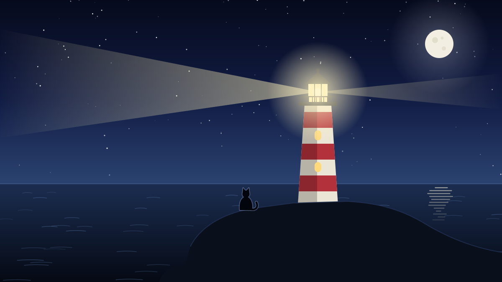
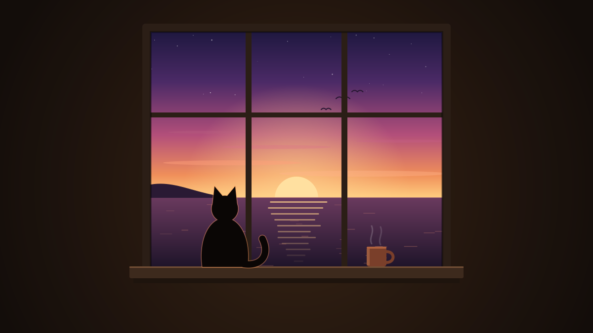

Nobody on Carrick Point could say where the cat came from. Old Tomas, who had kept the light for thirty-one years, said she arrived in a crate of tinned peaches on the supply boat. The boatman said she must have swum. The cat, a grey tabby with one white paw and the expression of someone who is owed money, said nothing at all.

Tomas named her Biscuit, because she was the colour of the ones he dunked in his tea, and because she ate one the first morning without asking.

## The routine

A lighthouse runs on routine, and Biscuit learned it faster than any assistant keeper Tomas had ever trained. At dusk he climbed the hundred and twelve steps to the lamp room; she climbed them ahead of him, stopping every twenty steps to look back, as if he were the one who might get lost. While he polished the lens and checked the lamp, she sat on the gallery rail with her tail wrapped around her feet and watched the beam go out across the water.

At midnight he wrote in the log: *wind south-west, sea moderate, visibility good.* Biscuit sat on the logbook. He wrote around her.

At dawn they put the light out together and went down to breakfast: porridge for him, a sardine for her, and the radio reading the shipping forecast to two souls who had no intention of going anywhere.

## The letter

The letter came in March, in a brown envelope that Tomas left on the table for three days before he opened it. The light was to be automated. A new lamp, solar panels, a sensor that could tell dusk from dawn better than any man. Engineers would come in the autumn. After that, the keeper's cottage would be locked up, and the keeper would be (the letter searched for a kind word and settled on) *relieved of duty.*

Tomas read it twice, folded it into quarters, and used it to level the wobbly leg of the kitchen table. Biscuit inspected the result and approved.

He did not tell anyone in the village how he felt about it, partly because nobody asked and partly because he did not know. Thirty-one years is long enough for a job to stop being a job. He had kept the light through storms that made the tower hum like a struck bell. He had once rowed out to a fishing boat with a broken rudder and towed it in by hand. He had never once let the light go dark.

## The last night

The engineers finished on a Thursday in October. The new lamp was a small, efficient thing, no bigger than a kettle, and it switched itself on at 6:47 p.m. without anyone touching it. The engineers shook Tomas's hand, called it *a real piece of history*, and caught the last boat back.

That night, out of habit, Tomas climbed the stairs anyway. Biscuit went ahead of him, stopping every twenty steps.

At the top there was nothing to do. No lens to polish, no log to keep. The little lamp blinked its pattern, two flashes every ten seconds, exactly as the old one had, and a little brighter. Tomas sat on the floor with his back against the wall. Biscuit sat on the rail.

"Well," he said to her. "That's us, then."

She looked at him the way she always did, as though he had said something faintly stupid, and turned back to the sea.

He stayed until midnight. Then he took a pencil from his pocket and wrote on the whitewashed wall, in small neat letters: *wind south-west, sea moderate, visibility good.* Then he went to bed.

## Afterwards

Tomas moved to a cottage in the village, close enough to see the light from his kitchen window. He assumed Biscuit would come with him. Biscuit assumed otherwise.

Three times he carried her across on the boat, and three times she was back on the Point within the week. Nobody ever worked out how. The boatman maintained that she swam.

In the end Tomas gave up and rowed out every Sunday with a tin of sardines. He would find her waiting on the landing, one white paw tucked under her, and the two of them would climb the hundred and twelve steps together. Nothing needed doing up there, but it was dusk, and that is what you do at dusk.

The fishermen on Carrick Point will tell you the new light is very reliable. They will also tell you that on certain evenings, if you look up at the gallery just as the lamp comes on, there is a small grey shape on the rail, watching the beam go out across the water. Making sure.
