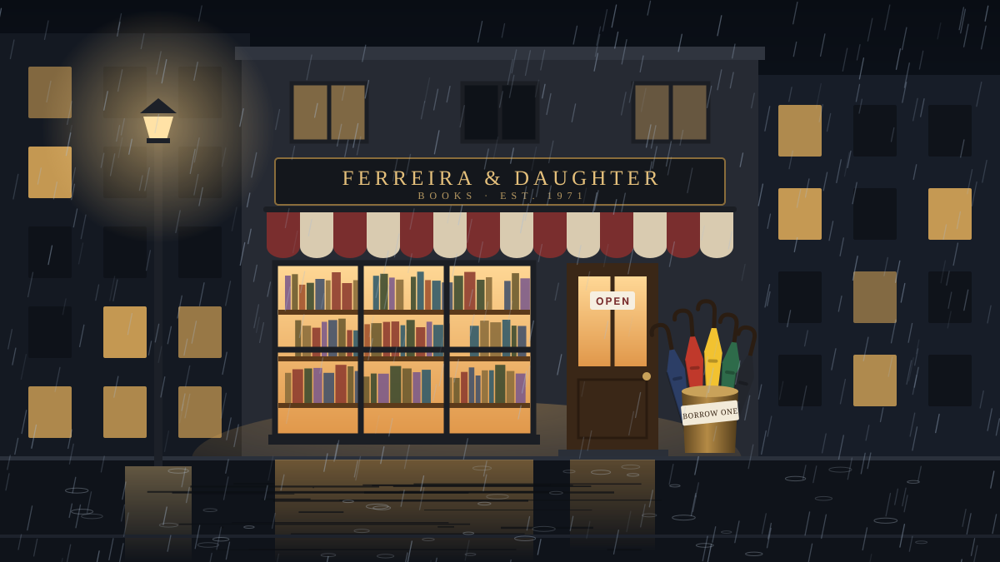

In the hill town of Kerrow it rained two hundred days a year, and on most of the others it was thinking about it.

Mr. Ferreira's bookshop sat halfway up Station Street, under a red-and-cream awning that had faded to pink-and-cream. The sign said FERREIRA & DAUGHTER, although there had never been a daughter. "It's aspirational," he told anyone who asked, and then he sold them a book they hadn't come in for.

By the door stood a brass stand full of umbrellas, and above it hung a card in careful handwriting: *Borrow one. Bring it back when the sun's out. Or don't, and bring it back when someone needs it.*

Mina was eleven the first time she borrowed one. She had come in after school to wait out a downpour, sat down on the floor with a book about lighthouses, and when she finally looked up, two hours had gone and Station Street had turned into a river.

"Take the yellow one," said Mr. Ferreira, without looking up from his crossword. "It's the most optimistic."

She took it. It was enormous, the colour of sunflowers, with a crooked wooden handle worn smooth by other people's hands. Walking home under it, up the long steps of Chapel Hill, she felt like she was carrying her own small sun.

She meant to bring it back, and she did, the next week. Then she borrowed it again, and brought it back, and borrowed it again, until it was understood by both of them, without anyone saying so, that the yellow umbrella was more or less hers.

At eighteen she got a place at a university in a city where it hardly rained at all. She packed in a hurry, the way you do at eighteen, and it was only on the train, when the window started to streak, that she found the yellow umbrella rolled up at the bottom of her bag.

She meant to post it back. She wrote out a parcel label, and then the label got lost, and then term started, and then it was the next year, and the next.

The umbrella went where she went. It went to three cities and two countries. It went to job interviews, and to a wedding that wasn't hers, and to one that was. It sheltered a stranger at a bus stop in Lisbon and a very wet dog in Glasgow. It was blown inside out on a bridge, and she sat down on the pavement and fixed it with a hair tie. Every time she opened it she thought, *I really must take this back.*

Twenty years later, her mother rang to say the bookshop was closing.

She took the train to Kerrow on a Tuesday. It was raining, obviously.

The shop was smaller than she remembered, the way places from childhood always are. The awning was almost white now. But the brass stand was still by the door, the card was still above it in the same careful hand, and when she pushed the door open the bell made the same tired little sound.

Mr. Ferreira was behind the counter, older and much thinner, doing the crossword.

"Ah," he said, looking at what she was holding. "The optimistic one."

She held it out. "I'm so sorry. I meant to bring it back. I've been meaning to for twenty years."

He took it gently, turned it over, and slid back a little brass collar near the handle that she had never once noticed. Rolled up tight inside was a strip of paper. He smoothed it out on the counter.

It was a list of names, in different handwriting and different inks, with dates going back to before she was born. The first said *A. Ferreira, 1971*. Then came a few dozen others. The last, in round, eleven-year-old letters that she recognised with a jolt, said *Mina*.

"Every umbrella has one," he said. "People write their name in it the first time they take it home. Most of them never notice the collar." He nodded at the stand. "You'd be surprised how many come back in the end. That green one has been to New Zealand and back. Twice."

"Why are you closing?" she asked.

"I'm eighty-four," he said. "And there was never a daughter, so." He smiled. "It was aspirational."

Mina looked at the list of names for a long time. Outside, the rain kept coming down on Station Street, the way it always had.

---

The shop did not close.

The sign over the door still says FERREIRA & DAUGHTER. People in Kerrow assume it's accurate now, and neither of them has ever bothered to correct it.

The yellow umbrella is back in the brass stand. Under Mina's name on the strip of paper in its handle there are three more names already. And on wet afternoons, when someone comes in to wait out the rain and loses track of the time, she looks up from the crossword and says, "Take the yellow one. It's the most optimistic."
