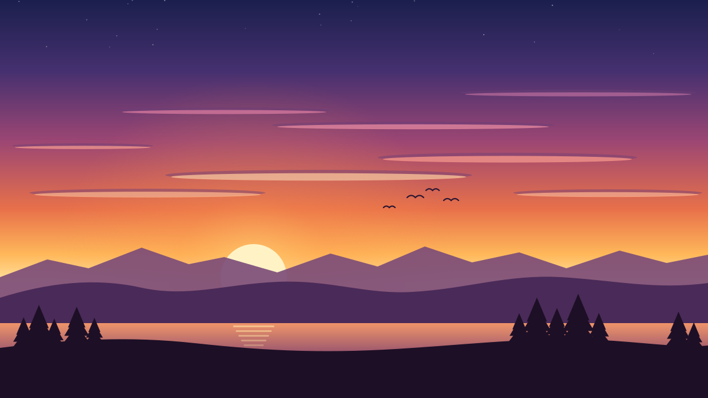
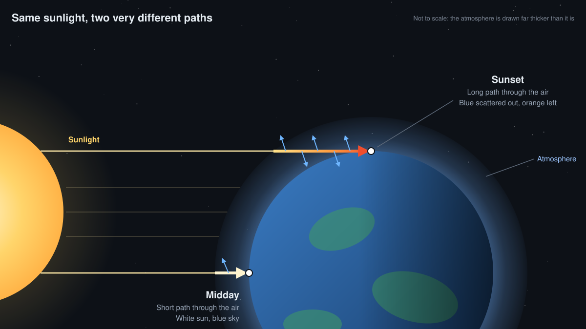

Every evening, for free, the sky puts on a show. The sun slides toward the horizon and turns from white to gold to deep orange, and the clouds light up in pink and red. It looks like magic, but it all comes down to one simple idea: **air scatters blue light much more than red light.**

## Sunlight is every colour at once

Sunlight looks white, but it is really a mix of all the colours of the rainbow, from violet and blue at the short-wavelength end to orange and red at the long end. A prism, or a raindrop, can pull them apart. Normally they arrive together, and our eyes add them up to white.

## Air is picky about colour

On its way to your eyes, sunlight passes through the atmosphere, which is mostly nitrogen and oxygen molecules. These molecules are far smaller than a wavelength of light, and when light meets something that small, some of it is bounced off in a new direction. This is called **Rayleigh scattering**, and its key feature is how strongly it depends on wavelength ($\lambda$):

$$
\text{scattering} \propto \frac{1}{\lambda^4}
$$

That fourth power makes a big difference. Blue light (about 450 nm) has a shorter wavelength than red light (about 700 nm), so it is scattered roughly $(700/450)^4 \approx 6$ times more strongly.

## Noon: why the sky is blue

When the sun is high, its light takes a short route through the air. Along the way, a fraction of the blue is scattered sideways, all over the sky. Look anywhere away from the sun and what you see is that scattered blue light reaching you from every direction. That's the blue sky.

The sun itself still looks white or pale yellow, because only a small share of its blue is lost on such a short trip.

> [!NOTE]
> Violet is scattered even more than blue, so why isn't the sky violet? The sun gives off less violet than blue, some of it is absorbed high in the atmosphere, and our eyes are much less sensitive to it. The mix we end up seeing reads as sky blue.

## Sunset: the long way round

Near sunset, the sun sits low on the horizon, and its light has to skim sideways through the atmosphere to reach you. That path is much longer. At the horizon, sunlight passes through roughly **38 times** as much air as it does when the sun is directly overhead.

Over that distance, the blue doesn't just get scattered a little; it gets scattered *out*, almost entirely, before the light reaches you. What survives the trip is the colours that air scatters least: yellow, orange and red. So the sun itself turns orange, and the light it throws onto clouds, buildings and faces turns warm and golden.

## Why clouds steal the show

The best sunsets usually have some clouds, especially high, thin ones. After the sun has dropped below your horizon, clouds high in the sky can still see it. They catch that reddened, low-angle light on their undersides and reflect it back down to you, which is why the sky can keep glowing pink and orange for a while after the sun has gone.

A clear sky gives you a smooth gradient; a few scattered clouds give you the fireworks. Thick, low cloud, on the other hand, just blocks the light.

## Dust, smoke and volcanoes

Extra particles in the air change the show. Fine dust, sea salt or wildfire smoke can deepen the reds, and sometimes turn the sun into a dim red disc. After big volcanic eruptions, such as Krakatoa in 1883 or Mount Pinatubo in 1991, fine particles spread high into the atmosphere around the world, and people reported unusually vivid sunsets for months afterwards.

## In short

- Sunlight contains every colour, and air scatters blue far more than red.
- At **noon**, light takes a short path. Scattered blue fills the sky, and the sun stays white.
- At **sunset**, light takes a long path. The blue is scattered away before it reaches you, and the orange and red get through.
- **Clouds** catch that red light from below and reflect it back down.
- **Particles** in the air, from dust to volcanic ash, can make sunsets even more intense.

> [!TIP]
> On Mars, it works the other way round. Fine Martian dust gives the daytime sky a butterscotch tint, but it scatters blue light forward, close to the direction of the sun, so the sky around a Martian sunset glows blue.
